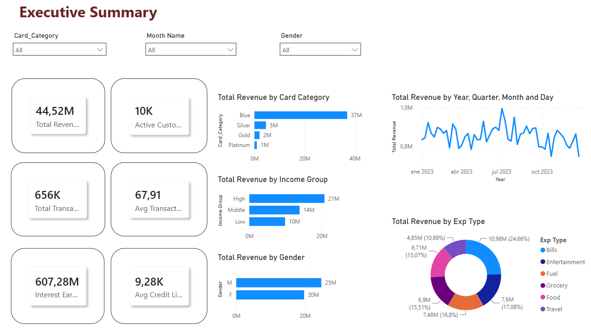
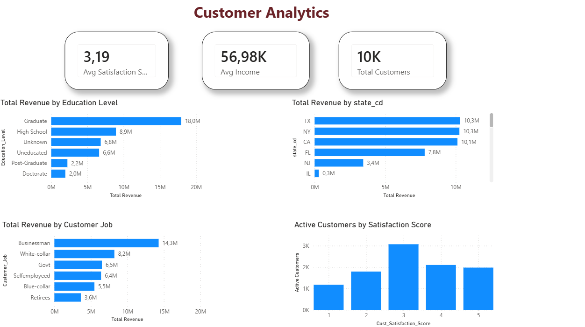
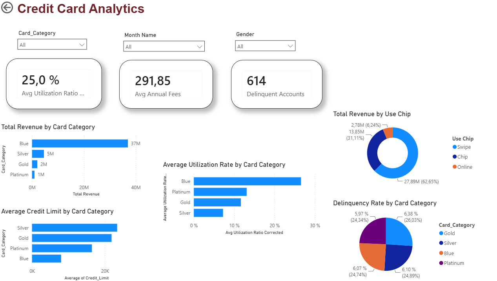

# Credit Card Financial Analytics Dashboard
## Project Overview

This project is an interactive Power BI dashboard that transforms raw financial data into actionable insights on credit card customer behavior, transactions, and performance. Built on customer and transaction datasets, it covers revenue trends, demographic analysis, credit utilization, delinquency tracking, and spending patterns — powered by data modeling and DAX calculations.

## Dashboard Pages
### 1. Executive Summary

Provides a high-level overview of business performance through key performance indicators (KPIs) and revenue analysis.

#### Key Metrics

- Total Revenue
- Active Customers
- Total Transactions
- Interest Earned
- Average Transaction Value
- Average Credit Limit

#### Visualizations

- Revenue Trend Analysis
- Revenue by Card Category
- Revenue by Gender
- Revenue by Expense Type
### 2. Customer Analytics

Analyzes customer demographics and behavioral patterns.

#### Visualizations

- Revenue by Education Level
- Revenue by Customer Job
- Revenue by State
- Customer Satisfaction Analysis

#### Business Questions

- Which customer groups generate the most revenue?
- How does customer education impact spending?
- Which states contribute the most revenue?
- How satisfied are customers overall?

### 3. Credit Card Analytics

Evaluates credit card performance and risk indicators.

#### Key Metrics

- Average Utilization Rate
- Average Annual Fees
- Delinquent Accounts

#### Visualizations

- Revenue by Card Category
- Average Credit Limit by Card Category
- Utilization Rate by Card Category
- Revenue by Payment Method (Chip / Swipe / Online)
- Delinquency Rate by Card Category

## Dataset
The project uses two datasets:

### Customer Dataset
Contains customer demographic and profile information:
- Client Number
- Age
- Gender
- Education Level
- Income
- Occupation
- State
- Customer Satisfaction Score

### Credit Card Dataset
Contains transaction and card-related information:
- Card Category
- Credit Limit
- Transaction Amount
- Transaction Volume
- Utilization Ratio
- Annual Fees
- Interest Earned
- Delinquent Accounts
- Expense Type

## Data Model

A star-schema model was implemented using the following relationships:

Customer (1) → Credit Card (Many)

Date Table (1) → Credit Card (Many)

A custom Date Table was created to support time intelligence and trend analysis.

## DAX Measures

Examples of measures created:
```
Total Revenue =
SUM(credit_card[Total_Trans_Amt])
```

```
Active Customers =
DISTINCTCOUNT(customer[Client_Num])
```
```
Avg Transaction Value =
DIVIDE(
    [Total Revenue],
    [Total Transactions]
)
```

```
Avg Utilization Ratio Corrected =
DIVIDE(
    AVERAGE(credit_card[Avg_Utilization_Ratio]),
    1000
)
```
## Key Insights
- Blue Card customers generated the highest revenue.
- Business professionals represented the highest revenue-generating customer segment.
- Revenue was concentrated in states such as Texas, New York, and California.
- Average utilization rates varied significantly across card categories.
- Swipe transactions represented the largest share of revenue.
## Tools & Technologies
- Power BI
- Power Query
- DAX
- Data Modeling
- Data Visualization
- Microsoft Excel

## How to Open

1. Download the `.pbix` file from the `/dashboard` folder
2. Open it with [Power BI Desktop](https://powerbi.microsoft.com/desktop/) (free to download)
3. All data is already embedded — no additional setup required
  
## Project Screenshots
- Executive Summary
### Executive Summary



*High-level KPIs including total revenue, active customers, interest earned, and revenue trends broken down by card category, gender, and expense type.*


### Customer Analytics



*Demographic breakdown of revenue by education level, occupation, and state, alongside customer satisfaction scores to identify high-value segments.*

### Credit Card Analytics



*Card performance metrics including utilization rates, delinquency by card category, average credit limits, and revenue split by payment method (chip, swipe, online).*
